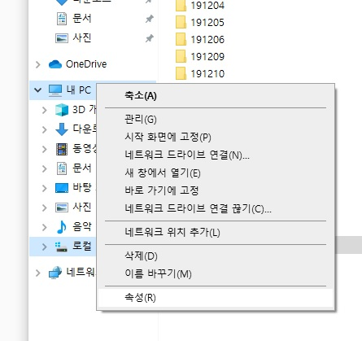
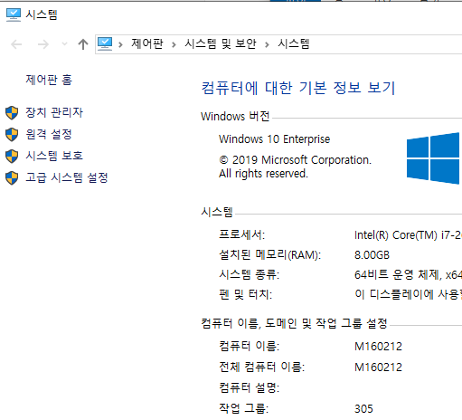
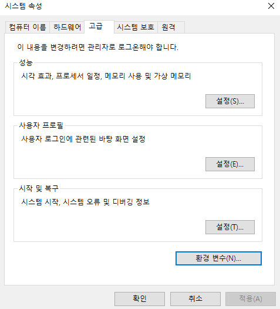
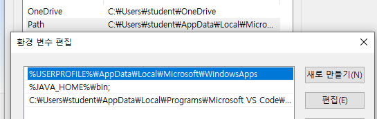
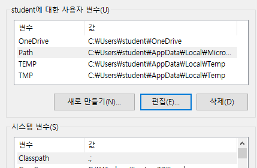
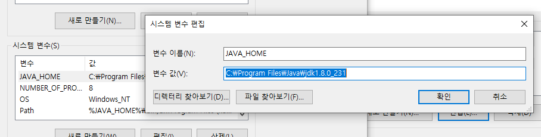
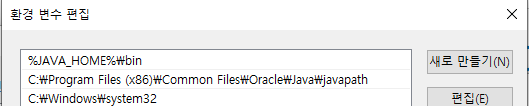

# Java 환경변수

* 내컴퓨터 -> 오른쪽 클릭 -> 속성

* 고급 시스템 설정 -> 환경변수

  

  

* 위쪽 탭 Path 에 `%JAVA_HOME%\bin;` 추가

  

  

* 아래 탭 변수 `Classpath`, 값 `.;`설정

  

* 변수 `JAVA_HOME`, 값 `'C:\Program Files\Java\jdk1.8.0_231(java설치장소)'` 설정

  

* Path 변수에서 `%JAVA_HOME%\bin` 추가 (맨위로 올리기)

